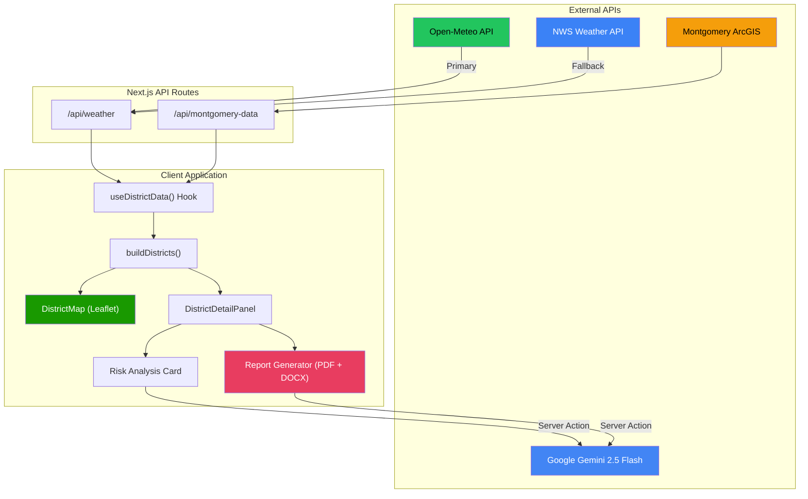
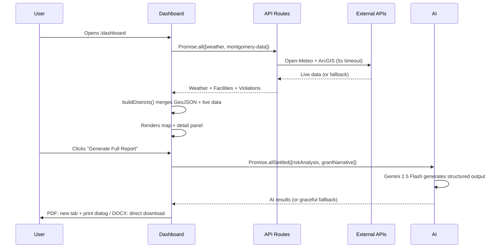
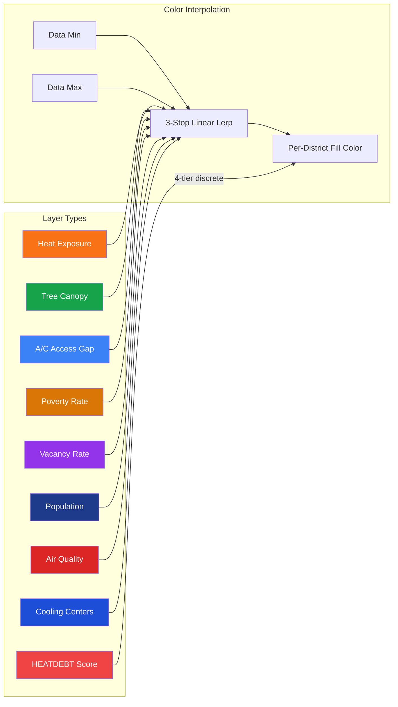

<p align="center">
  
</p>

<h1 align="center">HEATDEBT</h1>
<p align="center"><strong>Urban Thermal Equity Intelligence Platform</strong></p>

<p align="center">
  Real-time heat vulnerability monitoring for Montgomery, Alabama.<br/>
  14 census tracts. Live weather. Interactive choropleth. AI-powered risk analysis.
</p>

<p align="center">
  <a href="https://heat-alert-dev.vercel.app"></a>
  
  
  
  
  
</p>

---

## The Problem

Urban heat islands kill more Americans annually than hurricanes, tornadoes, and floods combined. In Montgomery, AL, surface temperatures can vary by **7+ degrees** between neighborhoods just miles apart. The difference traces directly to decades of disinvestment: less tree canopy, more asphalt, older buildings, fewer cooling centers.

**HEATDEBT** quantifies this thermal debt and makes it actionable — giving city planners, grant writers, and community advocates the data they need to direct resources where heat risk is highest.

---

## What It Does

| Feature                        | Description                                                                                                                                                           |
| ------------------------------ | --------------------------------------------------------------------------------------------------------------------------------------------------------------------- |
| **Interactive Choropleth Map** | 14 real US Census TIGER/Line tract boundaries on a dark CartoDB basemap. Click any vulnerability factor to recolor the entire map.                                    |
| **9 Map Layers**               | Toggle between HEATDEBT Score, Heat Exposure, Tree Canopy, A/C Access, Poverty Rate, Vacancy Rate, Population, Air Quality, and Cooling Centers.                      |
| **Live Weather Integration**   | Real-time temperature, humidity, UV index, precipitation, and wind from Open-Meteo (free, no API key). NWS fallback.                                                  |
| **AI Risk Analysis**           | Per-district vulnerability assessment powered by Google Gemini 2.5 Flash — risk score, key findings, prioritized recommendations, budget estimate.                    |
| **Dual-Format Reports**        | Full vulnerability report in PDF or Word (.docx): cover page, data grid with neighborhood comparison, AI interventions, community resources, and EPA grant narrative. |
| **Montgomery Open Data**       | Live integration with ArcGIS REST APIs for code violations, crime incidents, and community facilities.                                                                |
| **Polygon Visibility Toggle**  | Eye/EyeOff control to show or hide district overlays while keeping pulsing risk markers visible.                                                                      |

---

## Demo Video

A 75-second programmatic demo video is included, built with [Remotion](https://remotion.dev) — a React framework that renders video frame-by-frame at 1920x1080.

```bash
npm run remotion:preview   # Interactive preview in browser
npm run remotion:render    # Render to out/demo.mp4 (H.264, ~5 MB)
```

**10 animated scenes:** Intro → Problem Statement → Solution Pipeline → 9-Layer Map → AI Risk Analysis → 14-Page Reports → Grant Database → Tech Stack → Team → Outro.

All scenes use spring-based animations, animated score rings, progress bars, and fade transitions. Source in `remotion/`.

---

## Architecture



### Data Pipeline



### Map Layer System



---

## Tech Stack

| Layer          | Technology                                    |
| -------------- | --------------------------------------------- |
| **Framework**  | Next.js 14 (App Router)                       |
| **Language**   | TypeScript (strict mode)                      |
| **Styling**    | Tailwind CSS + shadcn/ui + Radix Primitives   |
| **Map**        | Leaflet + CartoDB Dark Tiles                  |
| **GeoJSON**    | US Census TIGER/Line 2020 tract boundaries    |
| **Weather**    | Open-Meteo API (primary) + NWS API (fallback) |
| **City Data**  | Montgomery ArcGIS REST APIs                   |
| **AI**         | Google Genkit + Gemini 2.5 Flash              |
| **Reports**    | HTML-to-PDF (window.print) + docx (Word)      |
| **Demo Video** | Remotion (React-based programmatic video)     |
| **Auth**       | Lightweight session-based auth                |
| **Deployment** | Vercel                                        |

---

## Project Structure

```
src/
├── app/
│   ├── api/
│   │   ├── weather/          # Open-Meteo proxy with NWS fallback
│   │   └── montgomery-data/  # ArcGIS proxy with 5s timeout
│   ├── dashboard/            # Main dashboard page
│   ├── login/                # Auth gate
│   ├── report/[districtId]/  # Web-based report view
│   ├── actions.ts            # Server actions for AI flows
│   └── page.tsx              # Landing page
├── ai/
│   ├── genkit.ts             # Genkit + Google AI config
│   └── flows/
│       ├── generate-district-summary-flow.ts
│       └── generate-grant-report-summary-flow.ts
├── components/
│   ├── dashboard/
│   │   ├── district-map.tsx          # Leaflet choropleth map
│   │   ├── district-detail-panel.tsx # Stats + AI + report
│   │   ├── map-layer-control.tsx     # 9-layer toggle panel
│   │   ├── heatmap-legend.tsx        # Dynamic legend
│   │   ├── district-summary-card.tsx # AI risk analysis
│   │   ├── pdf-report.tsx            # Premium HTML report builder (PDF)
│   │   ├── docx-report.ts            # Word document report builder (DOCX)
│   │   └── city-overview-bar.tsx     # Live weather header
│   ├── layout/
│   └── ui/                   # shadcn/ui primitives
├── hooks/
│   └── use-district-data.ts  # Data orchestration hook
└── lib/
    ├── constants.ts           # Thresholds, colors, URLs
    ├── district-data.ts       # District type + builder
    ├── montgomery-geojson.ts  # Real Census tract polygons
    ├── map-layers.ts          # Layer config + color interpolation
    └── api/
        ├── weather.ts         # NWS client
        └── arcgis.ts          # ArcGIS client
```

---

## Getting Started

### Prerequisites

- Node.js 18+
- Google AI API key (for Gemini features)

### Installation

```bash
git clone https://github.com/soneeee22000/HeatDebt.dev.git
cd HeatDebt.dev
npm install
```

### Environment

Create `.env.local`:

```env
GOOGLE_GENAI_API_KEY=your_gemini_api_key
```

No other API keys needed — weather and map tiles are free and unauthenticated.

### Development

```bash
npm run dev              # http://localhost:9002
npm run build            # Production build
npm run lint             # ESLint
npm run typecheck        # tsc --noEmit
npm run remotion:preview # Demo video preview
npm run remotion:render  # Render demo video to out/demo.mp4
```

---

## Data Sources

| Source                                                    | Data                                           | Auth Required |
| --------------------------------------------------------- | ---------------------------------------------- | :-----------: |
| [Open-Meteo](https://open-meteo.com)                      | Temperature, humidity, UV, precipitation, wind |      No       |
| [NWS API](https://api.weather.gov)                        | Weather observations (fallback)                |      No       |
| [US Census TIGER/Line](https://tigerweb.geo.census.gov)   | Tract boundary polygons                        |      No       |
| [Montgomery Open Data](https://opendata.montgomeryal.gov) | Code violations, crime, facilities             |      No       |
| [CartoDB](https://carto.com)                              | Dark basemap tiles                             |      No       |
| [Google Gemini](https://ai.google.dev)                    | AI risk analysis + grant narratives            |      Yes      |

---

## The 14 Districts

| District                      | Census Tract | Risk Tier | Key Challenge                                |
| ----------------------------- | :----------: | :-------: | -------------------------------------------- |
| West End / Washington Park    |    14.02     | CRITICAL  | Highest heat burden, HOLC Grade D since 1937 |
| Centennial Hill               |    11.01     | CRITICAL  | Historic district, aging infrastructure      |
| Mobile Heights / Smiley Court |    17.01     | CRITICAL  | Public housing, limited cooling              |
| Boylston / Ridgecrest         |    15.01     |   HIGH    | Industrial adjacency, poor air quality       |
| Capitol Heights / Cloverdale  |    12.01     |   HIGH    | Mixed-income, uneven canopy                  |
| Gibbs Village / MLK Area      |    20.01     |   HIGH    | Food desert overlap                          |
| Normandale / Hunter Station   |    13.01     |   HIGH    | Transit gaps, elderly population             |
| Old Cloverdale                |    11.02     | MODERATE  | Historic homes, moderate canopy              |
| Dalraida / Arrowhead          |    09.01     | MODERATE  | Suburban sprawl, impervious surfaces         |
| Hillwood / Woodland Park      |    16.01     | MODERATE  | School proximity, some green space           |
| McGehee / Halcyon             |    22.01     |    LOW    | Newer development, better infrastructure     |
| Eastchase / Taylor Crossing   |    30.01     |    LOW    | Commercial corridor, good AC access          |
| Pike Road Gateway             |    25.01     |    LOW    | Rural-suburban transition                    |
| Maxwell / Near SW             |    09.00     |    LOW    | Military base proximity, maintained grounds  |

---

## Report Generation

Two export formats — **PDF** (opens in new tab with print dialog) and **Word (.docx)** (direct download). Both produce a multi-page professional vulnerability report:

1. **Cover** — District name, HEATDEBT score ring, risk tier badge, census tract, date
2. **The Thermal Reality** — 9-cell data grid (heat index, poverty, tree canopy, A/C access, vacancy, air quality, population, green space, cooling centers) + **neighborhood comparison table** ranking all 14 tracts
3. **Vulnerability Analysis** — AI-generated risk assessment, key findings, prioritized interventions with budget estimates
4. **Community Resources & Facilities** — Mapped community facilities, nearby cooling centers, code violations, and safety indicators
5. **Grant Application Narrative** — AI-generated EPA Environmental Justice grant narrative with template variables pre-filled

AI analysis uses `Promise.allSettled` for parallel calls to Gemini with graceful fallback if either request fails.

---

## Team

Built by **Sone**, **Erisa** & **Adeline** for the [GenAI Academy World Wide Vibes Hackathon 2026](https://academy.genai.works) — Smart Cities track, City of Montgomery, Alabama.

---

<p align="center">
  <sub>Data: Open-Meteo | US Census ACS | NWS | Montgomery Open Data | Google Gemini</sub><br/>
  <sub>HEATDEBT — Urban Thermal Equity Intelligence Platform</sub>
</p>
